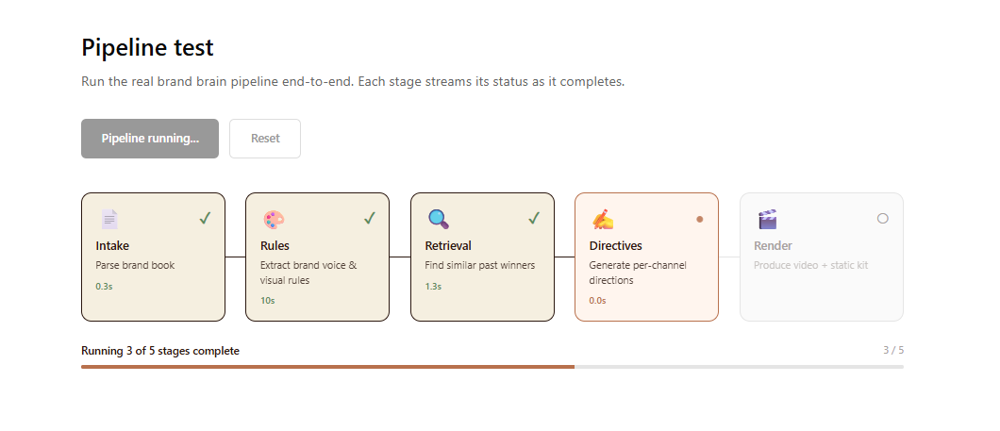
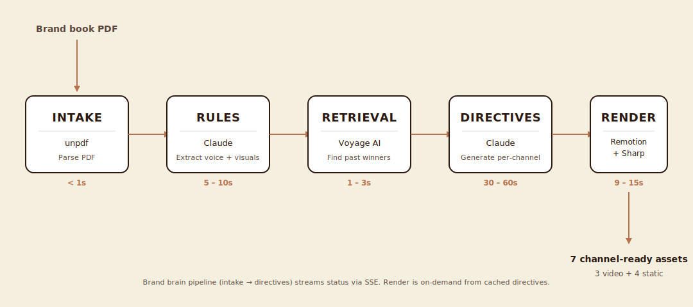

# Content Machine

> Turn brand books into channel-ready ad kits. An AI orchestration layer that reads brand guidelines, studies past winning ads, and produces video + static creative across every paid social channel in under 90 seconds.



---

## What this is

Modern marketing teams ship campaigns across Meta, TikTok, YouTube Shorts, and Google Display. Each channel has its own format, aspect ratio, and native creative conventions. Producing on-brand variants for every channel is slow, repetitive, and the first thing that gets cut when speed matters. Brand consistency erodes. Variant testing stalls. Past winners get forgotten.

Content Machine is a portfolio prototype that addresses this end-to-end. The system reads a brand book PDF, extracts the brand's voice and visual rules using Claude, retrieves similar past-winning ads via vector similarity, generates platform-specific creative directives, and renders both video (Remotion) and static (Sharp) ad outputs. The same brief produces seven channel-ready assets — three video aspect ratios and four static variants — all brand-compliant and ready to upload.

The architecture is "AI orchestration" rather than "AI generation": every stage produces structured, auditable output that the next stage consumes. The brand brain doesn't just produce creative — it produces reasoning. Every directive includes a rationale that maps brand voice + platform context + past winners → creative direction. This is the difference between an opaque AI tool and a system a marketing team could actually trust with their campaigns.

---

## What's real, what's shown

In any portfolio piece, it matters which parts are real production code and which are sample data. Here's the honest accounting:

**Real, end-to-end functional:**

- PDF parsing using `unpdf` (Node.js library, no AI)
- Brand rule extraction via Claude API with Zod schema validation
- Embedding generation via Voyage AI REST API (with exponential backoff for rate limits)
- Cosine similarity retrieval for finding relevant past ads
- Directive generation via Claude API with structured JSON output and retrieval context
- Video rendering via Remotion server-side renderer (real mp4 files, h264 codec)
- Static rendering via Sharp with SVG text overlays (real PNG files)
- Server-Sent Events streaming pipeline status from backend to frontend
- TypeScript strict mode throughout, with Zod runtime validation at LLM boundaries

**Sample data, included as demonstration:**

- The brand "Northbean" (a fictional cold brew company) — brand book PDF, brand voice rules, sample product photography
- Five fictional past ads with copy and (made-up) CTR/ROAS data, used to demonstrate retrieval
- A sample campaign brief for a summer subscription push

**Mocked for prototype clarity:**

- The rendering stage in the live pipeline visualization is mocked as instant-complete (real rendering happens via the dedicated `/api/render-video` and `/api/render-static` endpoints — separated to keep pipeline visualization fast)
- Production deployments would integrate brand asset ingestion via file upload, Google Drive sync, or DAM systems (Bynder, Frontify, Brandfolder); the prototype uses static files in `/public/samples/`

For a real client engagement, this same architecture consumes the client's actual brand assets, past ads, and campaign briefs — only the data source changes. The brand brain, retrieval, directive generation, and rendering pipelines are unchanged.


---

## Architecture

The system runs as a five-stage pipeline. Each stage produces output the next consumes, with clear data contracts between them.



**Stage 1 — Intake.** Parse the brand book PDF into raw text. Uses `unpdf` (the working alternative to the buggy `pdf-parse` package). Returns `{ rawText, pageCount, charCount }`. Typical duration: <1 second.

**Stage 2 — Rules.** Send the parsed text to Claude (Sonnet 4.5) with a structured prompt that extracts brand voice attributes, banned words, color hex codes, typography preferences, and per-channel notes. The output is validated against a Zod schema; if validation fails, the call retries once with the schema error as feedback. This is the runtime-validation pattern that catches LLM drift. Typical duration: 5-10 seconds.

**Stage 3 — Retrieval.** Embed past ads from `past-ads.json` via Voyage AI's `voyage-3.5-lite` model (called over REST because the official SDK has ESM packaging issues at the time of build). Embed the campaign brief as a query. Compute cosine similarity, return top-K matches with optional filters (top-performers-only, by-platform). Typical duration: 1-3 seconds.

**Stage 4 — Directives.** Send the brand rules, the brief, and the retrieved past ads as few-shot context to Claude, asking for platform-specific creative directives (hook, body copy, CTA, visual concept, rationale). Output is validated against a Zod schema. Each directive includes a `reasoning` field — an auditable explanation of why this creative direction fits the brand and platform. Typical duration: 30-60 seconds (the slowest stage, by design — this is where the strategic thinking happens).

**Stage 5 — Render.** Take the structured directives and produce real deliverables. Video renders use Remotion 4.x server-side rendering, with cached webpack bundles to avoid re-bundling between requests. Static renders use Sharp with SVG text overlays composited atop product photography. Video duration: 9-15 seconds per output, 1080p resolution. Static duration: 0.3-0.5 seconds per output.

The pipeline streams its progress to the frontend via Server-Sent Events. Each stage emits status updates (`running`, `complete`, `error`) that the React frontend folds into pipeline state. The visualization isn't decorative — it's the same data the backend produces, displayed in real-time.

---

## What gets produced

A single campaign brief produces seven channel-ready assets:

- **3 video aspect ratios** from one `AdSpot` composition: 9:16 (TikTok / Shorts), 1:1 (Meta Square), 4:5 (Meta Portrait). The composition uses `useVideoConfig()` to read its current canvas dimensions and adapt layout — no template duplication.
- **4 static variants** from one `renderStaticAd` function: Meta Square (1080×1080) and Google Display (1200×628), each with two visual treatments (image-top vs image-bottom for square; image-left vs image-right for landscape).


The visual hierarchy across all outputs is consistent — same brand fonts (Inter), same brand colors (Espresso `#2B1810`, Cream `#F5EFE0`, Copper `#B8714D`), same animation timing on videos. The renderer is brand-agnostic; the brand rules flow in as data, not code.

---

## Engineering decisions

Small details that took real time to get right and would otherwise be invisible:

**Zod for runtime LLM output validation.** Type definitions catch developer mistakes at compile time. Zod catches LLM drift at runtime. Both matter when shipping AI-driven systems — types alone don't help when Claude returns a JSON shape that's structurally valid but semantically wrong. We validate at every LLM boundary (rules extraction, directive generation) and retry on validation failure with the error message as feedback.

**Direct REST over the Voyage SDK.** The official `voyageai` npm package had ESM packaging issues at the time of build (the import statement breaks Next.js's bundler). Bypassing it with a direct `fetch` call to Voyage's REST endpoint is faster, smaller, and avoids the upstream bug entirely. Documented as a future migration target once the SDK is fixed.

**Caching the Remotion bundle.** Bundling Remotion compositions takes 10-30 seconds — too slow to do on every render. We cache the bundle promise at module level so only the first render pays the cost; subsequent renders reuse the cached bundle and complete in 9-15 seconds instead of 40+.

**Single-pass Sharp composition.** Chaining `sharp.create().composite([image]).composite([overlay])` doesn't reliably apply both composite layers. The correct pattern is single-pass: `sharp.create().composite([image, overlay])`. This is a silent failure mode — the wrong pattern produces output but loses one of the layers, with no error thrown. Documented in code comments for future maintainers.

**Sharp's hex-string color trap.** `sharp({ create: { background: '#F5EFE0' } })` silently fails — Sharp expects `{ r, g, b, alpha }` RGB objects, not hex strings. Wrong format produces a transparent or default-background canvas. Required a `hexToRgb` helper at the boundary between brand JSON (which uses hex) and Sharp's API.

**Next.js `serverExternalPackages` for native dependencies.** Remotion's renderer, bundler, and Sharp all have native binaries that Next.js's bundler shouldn't touch. Explicitly excluding them via the `next.config.ts` config is required for production builds. Without it, Turbopack tries to bundle native `.node` files and the build fails with cryptic errors.

**Discriminated unions for typed SSE events.** The pipeline endpoint emits two event types (`stage` and `pipeline`). Using a TypeScript discriminated union for the event shape lets the client narrow `event.type === "stage"` to access stage-specific fields without casting. Pattern: always prefer narrow types at API boundaries over generic `any` shapes.

**Server-Sent Events over WebSockets.** SSE is one-way (server → client), which is exactly what we need for pipeline status. No additional dependencies, no connection upgrade dance, native browser support via `ReadableStream`. WebSockets would be overkill for this use case.

**WSL Chrome dependencies.** Running Remotion's server-side renderer on WSL Ubuntu requires installing Chrome's runtime libraries (`libnss3`, `libnspr4`, `libasound2`, and ~12 others). Production deployments would use Docker images with these pre-installed, or Remotion Lambda. Documented in the "Try it locally" section below.


---

## Try it locally

Requires Node 20+, pnpm, an Anthropic API key, and a Voyage AI API key. On WSL/Linux, Chrome's runtime libraries are also needed for video rendering.

```bash
cat >> README.md << 'EOF'

---

## Try it locally

Requires Node 20+, pnpm, an Anthropic API key, and a Voyage AI API key. On WSL/Linux, Chrome's runtime libraries are also needed for video rendering.

```bash
# Clone and install
git clone <repo-url>
cd content-machine
pnpm install

# Linux/WSL only: install Chrome runtime libs for Remotion's renderer
sudo apt install -y libnss3 libnspr4 libasound2 libatk1.0-0 \
  libatk-bridge2.0-0 libcups2 libdrm2 libxkbcommon0 libxcomposite1 \
  libxdamage1 libxfixes3 libxrandr2 libgbm1 libpango-1.0-0 libcairo2

# Add API keys
cp .env.local.example .env.local
# Edit .env.local and add ANTHROPIC_API_KEY and VOYAGE_API_KEY

# Run
pnpm dev
```

Then visit:

- `http://localhost:3000` — the landing page
- `http://localhost:3000/pipeline-test` — run the live brand brain pipeline (real Claude + Voyage calls, ~60-90 seconds)
- `http://localhost:3000/kit` — see the rendered creative kit (videos + statics + directive JSON)

**Note on costs.** A full pipeline run makes 2 Claude calls (rule extraction + directive generation) and ~6 Voyage embedding calls. Total cost: roughly $0.02-0.05 per run on the current models. Video renders are local-compute only; no per-render API cost. Static renders are also local-compute only.

---

## Limitations and what's next

This is a portfolio prototype, not a production system. Honest limitations:

**Production deployment isn't trivial.** Remotion's video renderer needs Chrome and ~100MB of native dependencies — that doesn't fit on Vercel's free tier and requires either a Docker deployment, Remotion Lambda (AWS), or moving rendering to a dedicated worker service. The brand brain stages (intake, rules, retrieval, directives) deploy fine to serverless; only rendering needs special handling.

**Brand asset ingestion is mocked.** The prototype uses static files in `/public/samples/`. A real engagement would integrate with where the client's brand assets actually live: Google Drive folders, Notion databases, Figma libraries, or DAM systems (Bynder, Frontify, Brandfolder). Each integration is roughly 1-2 weeks of work depending on the system's API maturity.

**Layout polish on extreme aspect ratios.** Variant B layouts (image-bottom, image-right) have minor positioning glitches at edge cases — CTA buttons can overlap image transitions on certain text lengths. Production would extract per-variant layout configs rather than relying on the shared layout math.

**No A/B test harness.** The system produces variants but doesn't track which performed best in the client's actual ad accounts. A production version would integrate with Meta Ads Manager, TikTok Ads, and Google Ads APIs to pull performance data back into the retrieval index — closing the loop so the system learns from the client's wins.

**Render queue, not synchronous calls.** The prototype renders videos synchronously on request, which takes 9-15 seconds. Production would queue render jobs (BullMQ, AWS SQS), notify users when done, and parallelize across multiple workers. For a real client at scale, "click a brief → get a kit in 90 seconds" requires a real job system, not a single Next.js API route.

**Strategy modes.** The directive prompt encodes one "house style" (performance-focused, native to platform). A real engagement would build out 2-3 strategy modes — *Performance*, *Brand-led*, *Experimental* — so the marketing team can pick the content philosophy per campaign without changing brand rules.

---

## How I'd extend this for a real client

If the prototype convinced a client to engage, the rough phasing would be:

**Phase 1 — Discovery (1 week).** Audit the client's brand assets, past performance data, channel mix, and team workflow. Pick the right intake layer (file upload, Drive sync, DAM integration). Map their actual brand book to the rules schema.

**Phase 2 — Integration (2-3 weeks).** Connect the brand brain to their real data. Build the asset ingestion layer. Tune the directive prompt to their voice and channel preferences. Add their existing past-winner ads to the retrieval index.

**Phase 3 — Render pipeline (2 weeks).** Set up production rendering infrastructure (Remotion Lambda or Docker workers). Build a kit-review UI for the marketing team to approve/reject before publishing. Integrate with their existing creative review workflow (Frame.io, Filestage, internal Slack).

**Phase 4 — Feedback loop (ongoing).** Wire performance data back from Meta Ads Manager, TikTok Ads, Google Ads. The retrieval index updates as new winners emerge. Strategy modes get tuned per campaign type. The system gets better at producing their winners specifically.

The architecture supports all of this without rewrites. The prototype's pipeline contracts (rules schema, directive schema, render API) are the same contracts production would use.

---

## Tech stack

- **Framework:** Next.js 16 with App Router, TypeScript strict mode
- **AI:** Anthropic Claude (Sonnet 4.5) for rule extraction and directive generation
- **Embeddings:** Voyage AI (`voyage-3.5-lite`) for past-ad retrieval
- **Validation:** Zod for LLM output schemas
- **Video:** Remotion 4.x for server-side video rendering
- **Static:** Sharp with SVG overlays for static image composition
- **Streaming:** Server-Sent Events for pipeline status
- **Fonts:** Inter via `@remotion/google-fonts`

